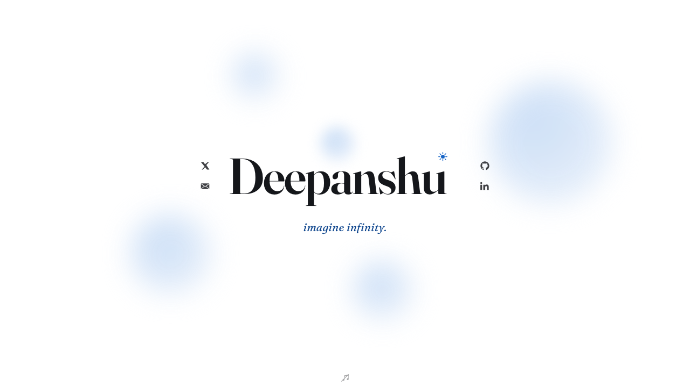

<div align="center">

# deepanshu

my corner of the internet. a name, a line, and a few things that surface when you're curious.

**[deepxanshu.github.io/deepxanshu →](https://deepxanshu.github.io/deepxanshu/)**

[X](https://twitter.com/depxanshu) · [GitHub](https://github.com/deepxanshu) · [LinkedIn](https://linkedin.com/in/deepanshuchaudhary)



</div>

---

built with plain html, css, and a little vanilla js — no framework, no build step.

- `index.html` — the page
- `writing.html` — fragments
- `site.js` — metaballs, theme, sound
- `styles.css` — everything visual

run it locally with any static server:

```
python3 -m http.server 8341
```

imagine infinity.
